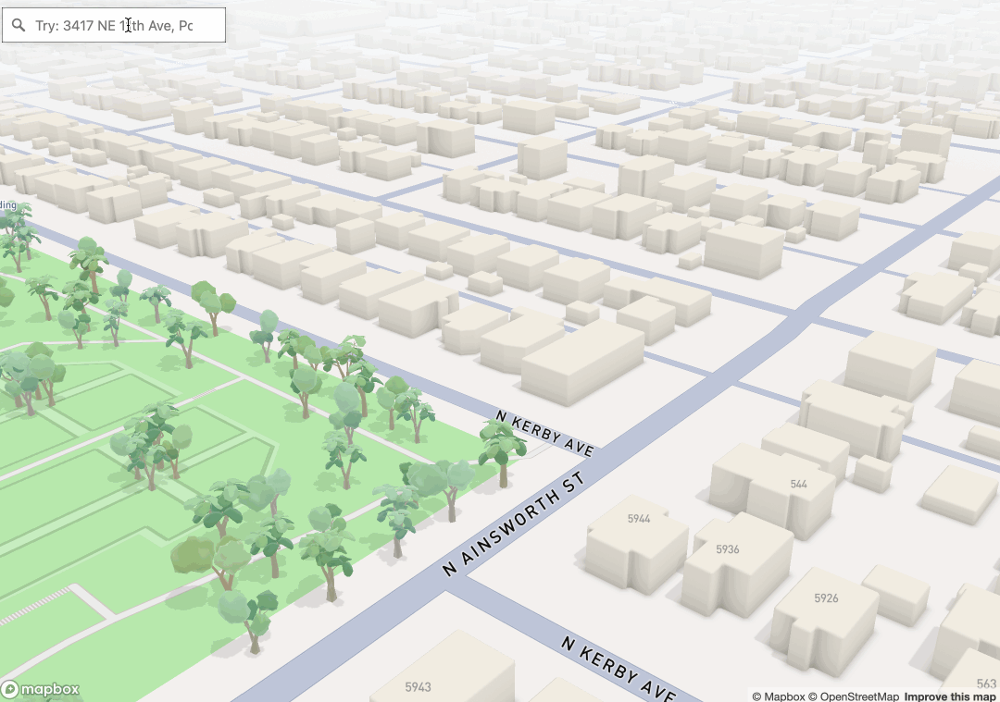

# Readme

Query addresses for Floor Area Ratio (FAR) in the City of Portland.

## Tech Stack

- Mapbox Geocoding API v6, Maps, Tilesets
- City of Portland (Taxlots, Zoning)
- Turf.js
- Spline (3D models)

